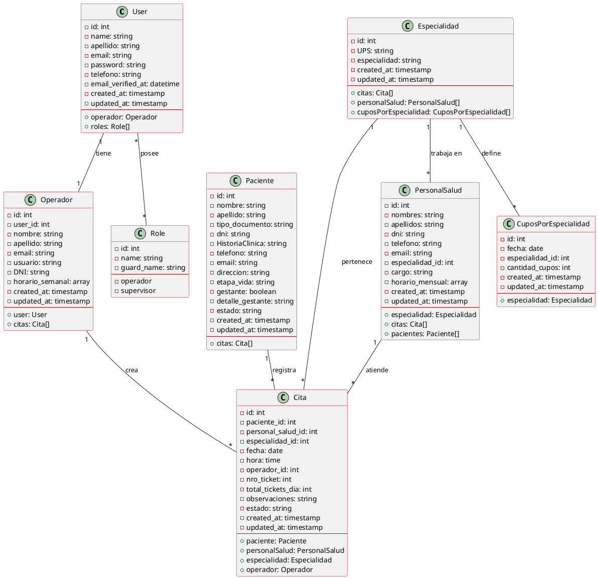
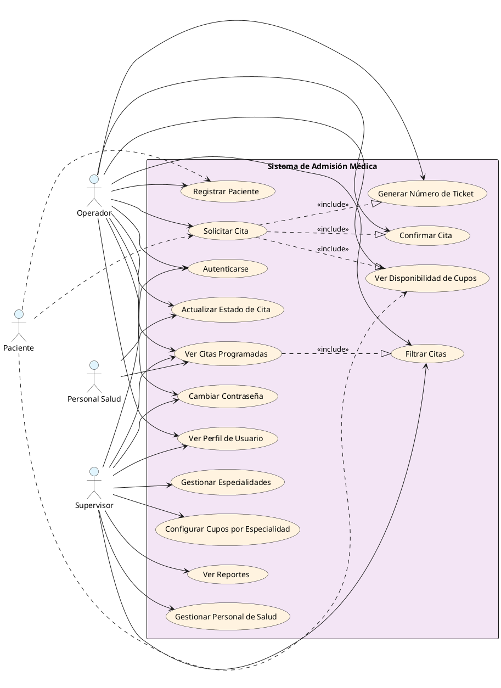
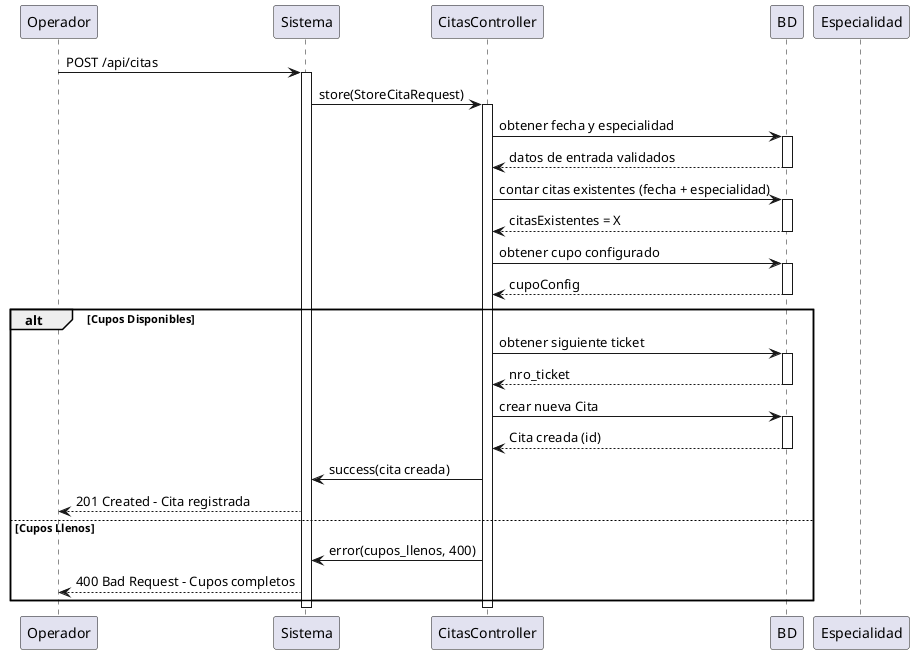
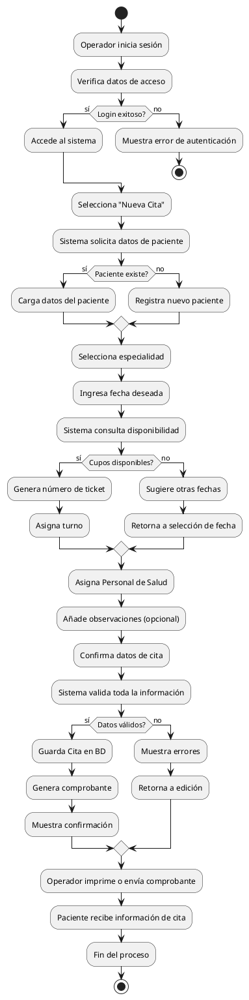
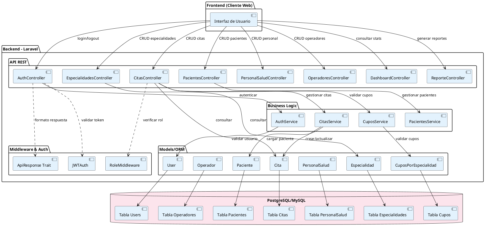
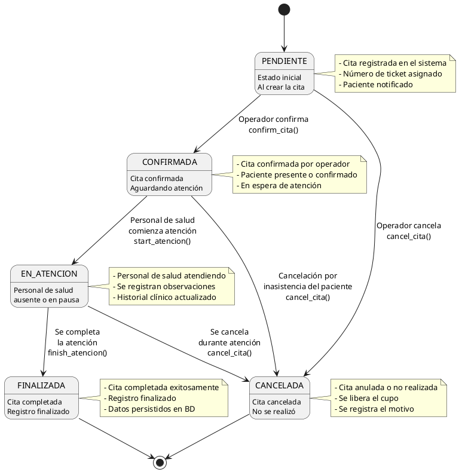

# Diagramas del Sistema de Admisión Médica

## 1. Diagrama de Clases

---

## 2. Diagrama de Casos de Uso

---

## 3. Diagrama Secuencial - Solicitud de Cita

---

## 4. Diagrama de Actividades - Proceso de Admisión

---

## 5. Diagrama de Componentes

---

## 6. Diagrama de Estados - Ciclo de Vida de una Cita

---

## Descripción General del Sistema

### Entidades Principales:
- **User**: Usuario del sistema con autenticación JWT
- **Operador**: Personal administrativo que registra citas
- **Paciente**: Personas que solicitan citas médicas
- **Cita**: Registro de atención médica programada
- **PersonalSalud**: Médicos/profesionales de salud
- **Especialidad**: Tipos de servicios médicos
- **CuposPorEspecialidad**: Control de capacidad por especialidad y fecha
- **Role**: Roles del sistema (operador, supervisor)

### Flujos Principales:
1. **Autenticación**: JWT con roles (operador, supervisor)
2. **Gestión de Citas**: CRUD con validación de cupos
3. **Control de Tickets**: Numeración automática por especialidad y fecha
4. **Reportes**: Consulta de citas por personal médico
5. **Perfil de Usuario**: Gestión de datos y contraseña

